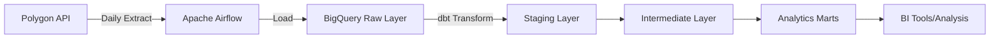

# Stock Market Analytics Pipeline

A production-grade data pipeline that ingests, transforms, and analyzes 5.3+ million rows of daily U.S. equity market data, focusing on Russell 3000 constituents. Built with modern data engineering best practices using Apache Airflow, dbt, and Google BigQuery.

## Architecture Overview


## Key Metrics

- Data Volume: 5.3+ million rows (11,000+ stocks × 500+ trading days)
- Daily Processing: ~11,000 new records
- Update Frequency: Daily at market close + 1 day
- Russell 3000 Coverage: ~85% (2,500+ active constituents)
- Historical Depth: 2+ years of trading data
- Pipeline Runtime: ~15 minutes end-to-end

## Technology Stack

- Orchestration: Apache Airflow 2.8+
- Data Warehouse: Google BigQuery
- Transformation: dbt Core 1.10.11
- Data Source: Polygon.io API
- Containerization: Docker & Docker Compose
- Language: Python 3.10+, SQL

## Project Structure

```text
stock_market_pipeline/
├── airflow/
│   ├── dags/                    # Airflow DAG definitions
│   │   └── market_data_pipeline_dag.py
│   ├── config/                  # Airflow configuration
│   └── plugins/                 # Custom operators/sensors
├── dbt/
│   └── stock_analytics/
│       ├── models/
│       │   ├── staging/              # Raw data cleaning layer
│       │   ├── intermediate/         # Russell 3000 filtered data
│       │   └── marts/                # Analytics-ready tables
│       ├── macros/                   # Reusable SQL functions
│       ├── seeds/                    # Russell 3000 constituent lists
│       └── tests/                    # Data quality tests
├── src/
│   ├── bigquery_client.py            # BigQuery operations
│   ├── extraction.py                 # Polygon API interface
│   ├── extract_load_polygon_data.py  # Main ETL logic
│   ├── config.py                     # Environmental variables loading logic
│   ├── load.py                       # Logic to load data to BigQuery
│   └── utils.py                      # Misc. utility logic
└── streamlit_app/
    ├── pages/                        # Pages for Streamlit App
    │   ├── 1_Market_Overview.py      # Page displaying general Market performance
    │   ├── In progress ....
    │   └── 3_Stock_Screener.py       # Page displaying latest metrics and screening filters
    ├── utilities/
    │    └── helper.py                # Helper functions for querying BigQuery
    └── streamlit_app.py              # Entrypoint file for Streamlit app  
```

## Known Limitations

### Corporate Actions Handling
- **Current State:** Historical data loaded on 9/18/25 is adjusted for splits/dividends up to that date via Polygon's adjusted data
- **Gap:** Splits/dividends occurring after initial load (e.g., 9/19/25+) are not retroactively applied to historical records
- **Impact:** Technical indicators (RSI, moving averages) may show anomalies for affected stocks
- **Planned Fix:** Implement daily corporate actions API check with retroactive adjustment logic

**Example:** A stock that split 10:1 on 9/19/25 will show artificially low RSI (~1.2) because pre-split prices aren't adjusted to post-split scale.

## Data Models

### Staging Layer

- `stg_daily_stocks` - Cleaned and typed raw market data (11k stocks)
- `stg_russell_3000__constituents` - Index membership with validity dates

### Intermediate Layer

- `int_russell3000__daily` - Filtered to Russell 3000 with enrichments (1.3M rows)

### Analytics Marts
#### `fct_trading_momentum` (1.3M+ rows)
Daily trading signals and technical indicators including:

- Simple Moving Averages (20, 50, 200-day)
- Relative Strength Index (RSI)
- Golden/Death Cross signals
- Volume metrics and 52-week highs/lows

#### `agg_daily_market_breadth` (~500 rows)
Market-wide health indicators:

- Advance/Decline ratios
- Percentage of stocks above key moving averages
- New highs/lows index
- Market momentum indicators

#### `dim_securities_current` (~2,500 rows)
Latest snapshot per ticker with:

- Current technical indicators
- Performance metrics (1w, 1m, 3m, YTD returns)
- Sector comparisons
- Volatility measurements

## Getting Started
### Prerequisites
- Docker & Docker Compose
- Google Cloud Platform account with BigQuery enabled
- Polygon.io API key
- 10GB+ free disk space

#### Installation
1. Clone the repository
```bash
git clone https://github.com/tmoore-prog/stock_market_pipeline.git
cd stock_market_pipeline
```
2. Set up environmental variables
```bash
cp .env.example .env
cp docker-compose.example.yaml docker-compose.yaml
# Edit both with your credentials:
# - POLYGON_API_KEY
# - GCP_PROJECT_ID
# - POLYGON_API_KEY
# - USER_NAME for Airflow UI sign-in
```
3. Configure BigQuery credentials
```bash
# Place your service account JSON in:
keys/big-query.json
```
4. Build and start services
```bash
docker compose up -d
```
5. Initialize dbt
```bash
cd dbt/stock_analytics
dbt deps # Install test extension packages
dbt seed # Load Russell 3000 constiuent data
```
6. Run initial historic load
```bash
# Access Airflow UI at http://localhost:8080
# Inspect airflow-apiserver logs to find Airflow UI login password
# Trigger: market_data_pipeline DAG
# This will load 2 years of historical data on first run
# Duration: ~3 hours
```
7. Enable daily pipeline
```bash
# Enable market_data_pipeline DAG
# Runs daily at 1200 EST while container is active
```

## Pipeline Workflow
### Daily Pipeline (market_data_pipeline)

1. Extract: Fetch previous trading day data from Polygon API
2. Load: Insert into BigQuery raw layer with checkpoint tracking
3. Transform: Run dbt models incrementally
4. Test: Execute data quality tests

### Key Features

- Checkpoint Recovery: Automatic backfill of missing dates
- Incremental Processing: Only processes new/changed data
- Data Quality Tests: 10+ custom tests ensure data integrity
- Point-in-Time Accuracy: Handles Russell 3000 rebalancing

## Testing
```bash
cd dbt/stock_analytics
dbt test # Runs all tests

dbt test --select fct_trading_momentum # Example of running specific model tests
```
### Custom singular dbt tests include:
- RSI range validation (0-100)
- Golden/Death Cross mutual exclusivity
- Advances/Declines/Unchanged totals reconciliation

## Data Quality
- Validation: Automatic detection of impossible price movements
- Freshness Checks: Alerts if data is >2 days old <-wip
- Completeness: Monitors for missing tickers or trading days
- Consistency: Validates technical indicator calculations

## dbt Documentation
```bash
# Generate and serve dbt documentation
cd dbt/stock_analytics
dbt docs generate
dbt docs serve
# Visit http://localhost:8080 to inspect
# Note: Must be done while Airflow container/Airflow UI is not running
```

## Monitoring
- Airflow UI: http://localhost:8080
- BigQuery Console: Monitor query performance and costs
- dbt Artifacts: Execution logs in `target/` directory

## Example Queries (BigQuery Console)
```sql
-- Find most recent golden crosses
SELECT ticker, company, sector
FROM `your_project.analytics.fct_trading_momentum`
WHERE trade_date = (SELECT MAX(trade_date) FROM `your_project.analytics.fct_trading_momentum`)
  AND golden_cross = 1;

-- Market breadth analysis
SELECT 
  trade_date,
  normalized_ad_ratio,
  market_rsi,
  CASE 
    WHEN pct_market_over_sma50 > 0.8 THEN 'Strong Bullish'
    WHEN pct_market_over_sma50 < 0.2 THEN 'Strong Bearish'
    ELSE 'Neutral'
  END as market_sentiment
FROM `your_project.analytics.agg_daily_market_breadth`
WHERE trade_date >= DATE_SUB(CURRENT_DATE(), INTERVAL 30 DAY);

-- Top performing stocks by sector
SELECT 
  sector,
  ticker,
  return_1m,
  outperformance_vs_sector
FROM `your_project.analytics.dim_securities_current`
WHERE performance_percentile > 0.9
ORDER BY sector, return_1m DESC;
```

## Configuration
### Adjusting Pipeline Schedule
Edit `airflow/dags/market_data_pipeline_dag.py`:
```python
schedule='0 12 * * 2-6' # This runs daily, Tuesday-Saturday at 1200, extracts data from previous trading day
```
### Modifying Technical Indicators
Edit macros in `dbt/stock_analytics/macros/`:

- `calculate_sma.sql` - Adjust moving average periods
- `calculate_return.sql` - Modify return calculations

## Troubleshooting
| Issue | Solution |
|---|---|
| Protobuf errors | Run `pip install --upgrade --force-reinstall protobuf` |
| Missing yesterday_close | Full refresh incremental models |
| Rate limit hit | Check Polygon API quota, readjust sleep timers |
| Memory issues | Increase Docker memory allocation |

## Performance Optimizations
- Partitioned Tables: Daily partitions on trade_date
- Clustered by Ticker: Optimizes ticker-specific queries
- Incremental Models: Process only new data
- Lookback Windows: 4-7 day windows for late-arriving data

## Future Enhancements
 - Streamlit dashboard for visualization -- In Progress
 - Machine learning features mart
 - Options data integration
 - Real-time streaming pipeline
 - Kubernetes deployment
 - Data quality alerting via Slack

## License
### MIT License - see LICENSE file for details

## Contributing
1. Fork the repository
2. Create a feature branch (git checkout -b feature/amazing-feature)
3. Commit changes (git commit -m 'Add amazing feature')
4. Push to branch (git push origin feature/amazing-feature)
5. Open a Pull Request

## Author
Trent Moore

GitHub: @tmoore-prog
LinkedIn: Trent Moore (https://www.linkedin.com/in/trent-moore-data-engineer)

## Acknowledgments

- Polygon.io for market data API
- dbt Labs for the transformation framework
- Apache Airflow community
- iShares Investments for index constituent data
